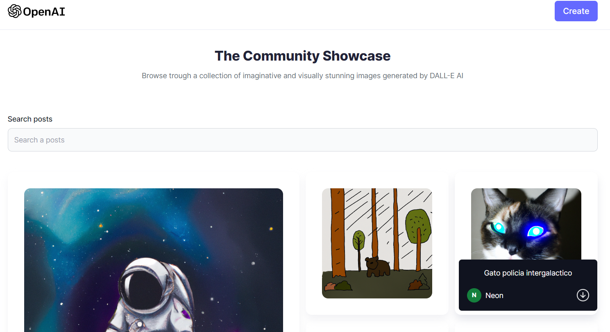
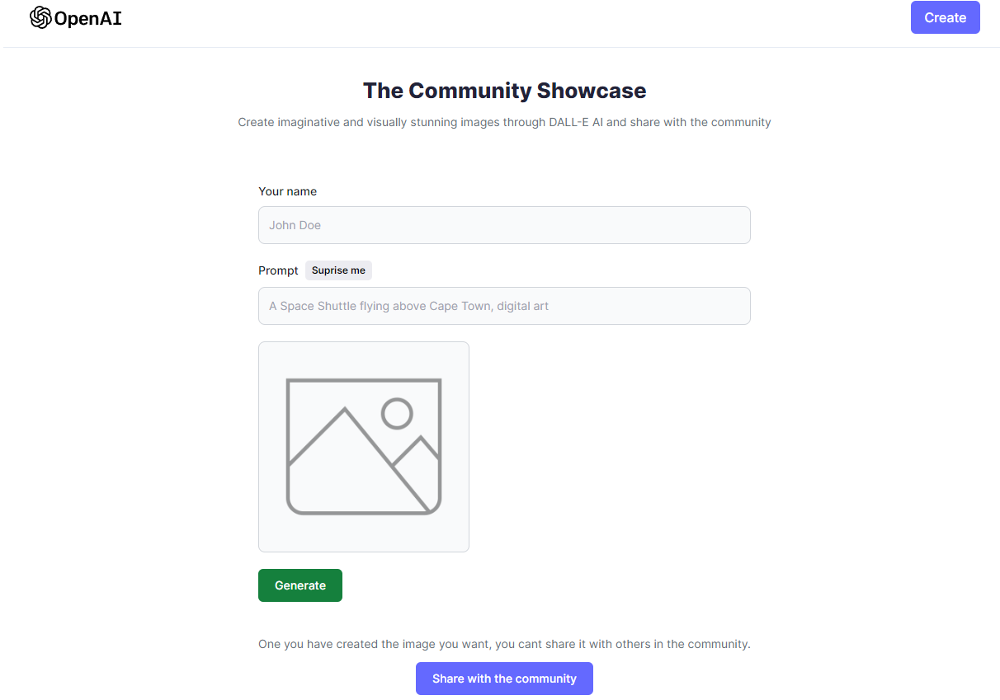

# Generador de imagenes con inteligencia artificial v1.0.0
## Descripción del proyecto

Este proyecto radica en un generador de imagenes con inteligencia artificial. Elaborado con MERN Stack, OpenAI y DALL-E,
cuenta con su modulo de cliente, donde se maneja el front-end, y su modulo server, utilizado en el back-end.
Sin embargo, este usa tecnología de Render (para despliegue back-end), Netlify (para despliegue front-end), 
OpenAI (para generar prompts de imagenes), y Cloudinary (para almacenar solo imagenes), 
Atlas MongoDB (para almacenar la información).

## Imagenes

Este es el inicio, en donde se muestra absolutamente todas las imagenes junto con su
prompt, usuario y descripción.

Este es el form para generar la imagen y decidir si compartirla con la comunidad.

## Recursos
El proyecto esta creado con las siguientes tecnologías, las primeras 4 se obtienen
al momento de crear el proyecto.

| Plugin                | URL                      |
|-----------------------|--------------------------|
| Cloudinary            | https://cloudinary.com/  |
| Render                | https://render.com/      |
| Netlify               | https://www.netlify.com/ |
| Atlas MongoDB           | https://www.mongodb.com/atlas/database |

## Para más información

Documentación de OpenAI: https://openai.com/blog/openai-api